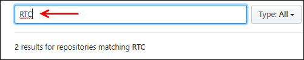

# Code Examples for ModusToolbox Software

There are hundreds of code examples available. Use the links below to find the example you want, learn more about each repo, and discover how to bring that code example into your development environment.

See [KBA225201](https://community.cypress.com/docs/DOC-15968) for details on importing a code example into the ModusToolbox IDE or a third-party IDE.

See the individual Mbed OS or Amazon FreeRTOS example repository for details on how to import each code example into the Mbed or Amazon FreeRTOS build system respectively. Typically you'll find the precise command line in the readme file. 

| Repo | Description |
| ----- | ----- |
|[PSoC 6 MCU Examples](https://github.com/cypresssemiconductorco?q=mtb-example-psoc6%20NOT%20Deprecated) | This link finds all PSoC 6 MCU-related repositories for ModusToolbox 2.x. These examples demonstrate the MCU and its features and functionality. |
|[AnyCloud SDK Examples](https://github.com/cypresssemiconductorco?q=mtb-example-anycloud%20NOT%20Deprecated) | This search link displays AnyCloud examples for PSoC 6 MCUs with CYW43xxx connectivity devices. These examples demonstrate how to use ModusToolbox Wi-Fi and Bluetooth connectivity libraries that are not tied to a specific cloud or device management solution. These include MQTT publisher and subscriber, OTA bootloading, and secure socket examples. |
|[Bluetooth SDK Examples](https://github.com/cypresssemiconductorco?q=mtb-example-btsdk%20NOT%20Deprecated)| This link finds all btsdk-related examples. |
| [Mbed OS Examples](https://github.com/cypresssemiconductorco?q=mbed-os-example%20NOT%20Deprecated) |This link displays a list of all Mbed-OS examples on the Cypress GitHub site, including CapSense, the emWin library, AWS IoT, and more.|
| [AWS IoT Examples](https://github.com/cypresssemiconductorco?q=afr-example%20NOT%20Deprecated) |This link displays a list of all Cypress Amazon FreeRTOS examples. In addition, the Amazon FreeRTOS repository [demo folder](https://github.com/cypresssemiconductorco/amazon-freertos/tree/master/demos) contains multiple examples, including additional AWS IoT examples. Some examples may not be supported on Cypress hardware. See the Getting Started guide for each board, available through the repository [ReadMe file](https://github.com/cypresssemiconductorco/amazon-freertos/blob/master/README.md).|

The AWS examples rely on the [AWS IoT Client Library](https://github.com/cypresssemiconductorco/aws-iot). The examples will link to that library automatically.

Some of the links above just search our repositories to find what you're looking for. To create your own search, go to the [Cypress GitHub home page](https://github.com/cypresssemiconductorco) and enter a search term in the **Find a repository** field.

These examples and links reference ModusToolbox 2.0. If you are interested in code examples for ModusToolbox v1.1:

- For legacy MCU examples [this repository](https://github.com/cypresssemiconductorco/Code-Examples-for-the-ModusToolbox-PSoC-6-SDK).
- For legacy Bluetooth SDK examples [this repository](https://github.com/cypresssemiconductorco/Code-Examples-BT-SDK-for-ModusToolbox). 

# ModusToolbox Software

ModusToolbox™ software is a collection of tools and libraries that enable you to develop embedded and connected applications in your ecosystem of choice. ModusToolbox software includes configuration tools, low-level drivers, middleware libraries, and operating system support, as well as other packages that enable you to create MCU and wireless applications. It also includes the optional ModusToolbox IDE. Unless specifically stated otherwise, ModusToolbox resources are compatible with Linux®, macOS®, and Windows®-hosted environments.

# Kits
Cypress provides low-cost development kits for the PSoC 6 MCU platform.

[PSoC 6 BLE Pioneer Kit (CY8CKIT-062-BLE)](http://www.cypress.com/cy8ckit-062-ble): The PSoC 6 BLE Pioneer Kit  enables design and debug of the PSoC 63 Line. The kit includes an E-Ink display, and Cypress' industry-leading CapSense® technology.

[PSoC 6 BLE Prototyping Kit (CY8CPROTO-063-BLE)](https://www.cypress.com/documentation/development-kitsboards/psoc-6-ble-prototyping-kit-cy8cproto-063-ble): a low-cost hardware platform that enables design and debug of PSoC 6 MCUs. This kit is designed with a snap-away form-factor, allowing users to separate the KitProg (on-board programmer and debugger) from the target board and use independently.

[PSoC 6 WiFi-BT Pioneer Kit (CY8CKIT-062-WIFI-BT)](http://www.cypress.com/CY8CKIT-062-WiFi-BT): The PSoC 6 WiFi-BT Pioneer Kit enables design and debug of the PSoC 62 MCU and the Murata LBEE5KL1DX Module (CYW4343W WiFi + Bluetooth Combo Chip). It includes a TFT display and Cypress' industry-leading CapSense technology.

[PSoC 6 Wi-Fi BT Prototyping Kit (CY8CPROTO-062-4343W](http://www.cypress.com/cy8cproto-062-4343w) enables design and debug of PSoC 6 MCUs. It comes with industry-leading CapSense technology for touch buttons and slider, on-board debugger/programmer with KitProg3, μSD card interface, 512-Mb Quad-SPI NOR flash, PDM-PCM microphone, and a thermistor. It also includes a Murata LBEE5KL1DX module, based on the CYW4343W combo device.

# Technical Resources

Cypress provides a wealth of data at [www.cypress.com](http://www.cypress.com/) to help you select the right PSoC device and effectively integrate it into your design. Visit our [PSoC 6 MCU](http://www.cypress.com/psoc6) webpage to explore more about PSoC 6 MCU family of device.

For a comprehensive list of PSoC 6 MCU resources, see [KBA223067](https://community.cypress.com/docs/DOC-14644) in the Cypress community.

#### [PSoC 6 MCU Datasheets](http://www.cypress.com/psoc6ds)
Device datasheets list the features and electrical specifications of PSoC 6 families of devices.

#### [PSoC 6 MCU Application Notes](http://www.cypress.com/psoc6an)
Application notes are available on the Cypress website to assist you with designing your PSoC application.

#### [PSoC 6 MCU Technical Reference Manuals](http://www.cypress.com/psoc6trm)
The TRM provides detailed descriptions of the internal architecture of PSoC 6 devices.

### Cypress Developer Community ##

Need support for your design and development questions? Check out the [ModusToolbox Forum](https://community.cypress.com/community/modustoolbox/overview), or the [PSoC 6 forum](https://community.cypress.com/community/psoc-6) on the [Cypress Developer Community 3.0](https://community.cypress.com/welcome). Interact with technical experts in the embedded design community and receive answers verified by Cypress' very best applications engineers. You'll also have access to robust technical documentation, active conversation threads, and rich multimedia content.

[Community Forums](https://community.cypress.com/welcome) | [Videos](http://www.cypress.com/video-library) | [Blogs](http://www.cypress.com/blog) | [Training](http://www.cypress.com/training)
